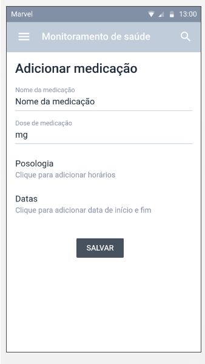

# Informações do Projeto
`MONITORAMENTO DE SAÚDE`

`ENGENHARIA DE SOFTWARE NOTURNO - 2022-2` 

Projeto de desenvolvimento web front-end para a disciplina Trabalho Interdisciplinar de Interfaces Web do curso de Engenharia de Software noturno da PUC Minas.

Escopo: aplicação para monitoramento de saúde e compartilhamento de dados com profissionais de saúde.

Desenvolvido com:
* HTML5
* CSS3
* JavaScript
* Bootstrap

## Participantes

Os membros do grupo são: 
* Lucas Araújo Pacheco
* Marco Tulio Mendes Moura
* Matheus Augusto Avelar de Souza
* Milena Lara Reis Ferreira
* Octavio Walter Rattes Soares
* Pedro Henrique Schmitberger Pelisson

# Estrutura do Documento

- [Informações do Projeto](#informações-do-projeto)
  - [Participantes](#participantes)
- [Estrutura do Documento](#estrutura-do-documento)
- [Introdução](#introdução)
  - [Problema](#problema)
  - [Objetivos](#objetivos)
  - [Justificativa](#justificativa)
  - [Público-Alvo](#público-alvo)
- [Especificações do Projeto](#especificações-do-projeto)
  - [Personas e Mapas de Empatia](#personas-e-mapas-de-empatia)
  - [Histórias de Usuários](#histórias-de-usuários)
  - [Requisitos](#requisitos)
    - [Requisitos Funcionais](#requisitos-funcionais)
    - [Requisitos não Funcionais](#requisitos-não-funcionais)
  - [Restrições](#restrições)
- [Projeto de Interface](#projeto-de-interface)
  - [User Flow](#user-flow)
  - [Wireframes](#wireframes)
- [Metodologia](#metodologia)
  - [Divisão de Papéis](#divisão-de-papéis)
  - [Ferramentas](#ferramentas)
  - [Controle de Versão](#controle-de-versão)
- [**############## SPRINT 1 ACABA AQUI #############**](#-sprint-1-acaba-aqui-)
- [Projeto da Solução](#projeto-da-solução)
  - [Tecnologias Utilizadas](#tecnologias-utilizadas)
  - [Arquitetura da solução](#arquitetura-da-solução)
- [Avaliação da Aplicação](#avaliação-da-aplicação)
  - [Plano de Testes](#plano-de-testes)
  - [Ferramentas de Testes (Opcional)](#ferramentas-de-testes-opcional)
  - [Registros de Testes](#registros-de-testes)
- [Referências](#referências)

# Introdução

Hoje profissionais que atuam na área média encontram cenários cada vez mais complexos: com o avanço da medicina e da tecnologia no geral nas últimas décadas, as possibilidades de diagnóstico, exames e tratamentos se expandiram muito. Além disso, o intercâmbio de informações entre méddicos e médicas de diferentes especialidades e as constribuições dos demais profissionais da saúde são muito enriquecedoras. Nesse contexto, quanto mais e mais precisas são as informações a que profissionais da área têm acesso, maiores as chances de que possam diagnosticar e tratar corretamente pacientes.

## Problema

Um problema recorrente que médicas e médicos e outras pessoas que atuam na área da saúde enfrentam é a falta de informações de pacientes para descrever os próprios sintomas, o que dificulta muito o diagnóstico preciso. Isso se dá através da falta de educação em saúde e, consequentemente, de vocabulário destes. Há também a falta de organização: não levar ou perder exames, que precisam ser repetidos (o que acaba se tornando um problema até de desperdício de recursos no caso da rede pública), não saber a data e horário de aparecimento dos sintomas, etc. Em alguns casos, a desorganização pode atrapalhar no tratamento também - no caso de antibióticos, é preciso disciplina no horário de tomar as medicações, por exemplo.

Além de informações fornecidas pela própria pessoa paciente, informações de tratamentos realizados em outros hospitais pode ser muito útil para médicos e médicas. No caso da rede pública de saúde, existe um sistema unificado, o eSus, que fornece essas informações, mas ele ainda possui algumas limitações (por exemplo, falta de mecanismo de busca no histórico de paciente) e em alguns hospitais ainda é preterido em favor dos sistemas internos da instituição. Na rede particular, o acesso a informações de outros hospitais já é mais limitado, por não existir esse sistema unificado.

## Objetivos
O objetivo principal deste trabalho é apresentar uma ferramenta de monitoramento de saúde dos pacientes da rede pública ou privada. Além de ser uma ambiente em que os profissionais da área possam compartilhar de seus diagnósticos, e atender determinados pacientes de forma remota.
Como objetivos específicos, podemos mencionar:
* Uma rede de compartilhamento de fichas dos pacientes para facilitar o atendimento
em outro hospital.
* Ser uma ambiente onde os pacientes poderão compreender melhor sobre seus
sintomas, e assim conseguir ser mais claro durante as consultas.

## Justificativa

Por meio das entrevistas realizadas com os profissionais da saúde foi possível observar que existe um problema de comunicação entre o mesmo e o paciente, onde o paciente por falta de entendimento claro sobre os sintomas pode acabar omitindo certos detalhes, ou não conseguirem se expressar. Além da falta de troca de dados dos pacientes entre os hospitais, independe de que sejam da rede pública ou privada.

Entretanto, ao entrevistar os pacientes e até mesmo os responsáveis, foi encontrado queixas sobre a dificuldade de conseguir acompanhar corretamente o tratamento, em marcar uma consulta, ou até mesmo em ser atendido.

## Público Alvo

O público alvo do nosso trabalho foi definido depois de analisados os perfis das pessoas entrevistadas que mais tendem a usufruir de algum benefício do nosso propósito, ou seja, aqueles que tenham maior perspectiva de se tornar um usuário. 
Chegamos aos seguintes perfis:
•	Gênero: masculino e feminino.
•	Faixa etária: pessoas de 18 a 60 anos.
•	Escolaridade: ensino médio completo.
•	Renda: Acima de 3 salários mínimos.
•	Classe social: A partir da classe média.
•	Localização: habitantes de cidades com mais de 100 mil habitantes.
•	Hábitos de consumo: pessoas ligadas a tecnologia, que gostam de buscar uma vida mais saudável, consumo de alimentos preferencialmente orgânicos, fazem acompanhamento periódico com médico, procuram informação sobre saúde de forma auxiliar na internet em complementariedade com o profissional qualificado.

# Especificações do Projeto

A definição exatada e os pontos mais importantes a serem tratados neste projeto foi consolidado por meio de entrevistas com os usuários. E os detalhes levantados nesse processo foram consolidados na forma de persona e hitórias de usuários.

## Personas e Mapas de Empatia

As personas e mapa de empatia levantados durante o processo de entendimento do problema são aprensentados abaixo:

1.Eduardo

2.Bruna

3.Marcelle

4.Túlio

5.Mariela

## Histórias de Usuários

Com base na análise das personas forma identificadas as seguintes histórias de usuários:

|EU COMO... `PERSONA`| QUERO/PRECISO ... `FUNCIONALIDADE` |PARA ... `MOTIVO/VALOR`                 |
|--------------------|------------------------------------|----------------------------------------|
|Médico do SUS | Registrar o prontuário de pacientes | Ter acesso a dados que auxiliem nos diagnósticos |
|Médico do SUS | Pesquisar palavras-chave no histórico de pacientes | Confirmar dados e datas que o paciente não tem com precisão |
|Médico do SUS | Ler exames de pacientes | Melhorar a precisão dos diagnósticos |
|Médico do SUS | Saber detalhes dos sintomas de pacientes: data de início, duração, intensidade | Melhor  ar a precisão do diagnóstico|
|Médico particular | Melhorar a comunicação com pais e tutores | Estabelecer uma melhor relação médico-paciente |
|Médico particular |Entender o problema do paciente | Para realizar diagnósticos mais precisos, indicar tratamentos e alinhar com ele suas expectativas/frustrações |
|Médico particular |Evitar/diminuir possibilidade de erros no diagnóstico | Evitar o mal estar do paciente |
|Paciente |Poder enviar meus exames | Ter um melhor diagnóstico sobre meu caso|
|Paciente |Informar se estou com algum sintoma | Ter uma avaliação mais precisa|
|Paciente |Informar quando os sintomas começaram | Para ter uma avaliação sobre a urgência do caso|
|Cuidador de paciente idoso | Ministrar medicações nas dosagens e horários corretos | Para não comprometer os tratamentos |
|Cuidador de paciente idoso | Compartilhar exames e histórico de cirurgias e tratamentos | Para ter maior controle de evolução dos quadros e auxiliar nos diagnósticos pelos médicos |
|Cuidador de paciente idoso | Monitorar sintomas e evolução dos quadros do idoso | Para identificar a necessidade de contatar médicos especialistas |

## Requisitos

As tabelas que se seguem apresentam os requisitos funcionais e não funcionais que detalham o escopo do projeto.

### Requisitos Funcionais

|ID    | Descrição do Requisito  | Prioridade |
|------|-----------------------------------------|----|
|RF-001| Permitir que o usuário paciente envie seus exames em arquivos pdf | MÉDIA | 
|RF-002| Permitir que o usuário paciente informe os sintomas que apresenta | MÉDIA |
|RF-003| Permitir que o usuário paciente dê detalhes sobre os sintomas como a data quando começou a sentir e intensidade | MÉDIA |
|RF-004| Permitir que o usuário cadastre quais medicações está utilizando | MÉDIA |
|RF-005| Permitir que o usuário tenha acesso a uma lista de quais medicações está fazendo uso | MÉDIA |
|RF-006| Permitir que o usuário médico tenha acesso aos registros de sintomas dos pacientes em uma única página |MÉDIA |
|RF-007| Permitir que o usuário tenha acesso a uma lista de consultas cadastradas. | MÉDIA |
|RF-008| Permitir que o usuário cadastre um médico no sistema. | MÉDIA |
|RF-009| Permitir que o usuário tenha acesso a uma lista de médicos cadastrados. | MÉDIA |
|RF-0010| Redirecionar o usuário para a home page ou para uma tela de sintomas, dependendo da opção escolhida na tela de "Como você está hoje?". | MÉDIA |

### Requisitos não Funcionais

|ID     | Descrição do Requisito  |Prioridade |
|-------|-------------------------|----|
|RNF-001| O sistema deve ser responsivo para rodar em um dispositivos móvel | ALTA | 
|RNF-002| O sistema deve ser compatível com os principais navegadores do mercado | ALTA | 
|RNF-003| Deverá ser desenvolvido usando HTML, CSS e JavaScript | ALTA | 
|RNF-004| Deverá ser desenvolvido usando o framework Boostrap | MÉDIA | 
|RNF-005| Deve processar requisições do usuário em no máximo 3s |  BAIXA | 
|RNF-006| O sistema deve pesar no máximo 1000kb |  BAIXA | 

## Restrições

O projeto está restrito pelos itens apresentados na tabela a seguir.

|ID| Restrição                                             |
|--|-------------------------------------------------------|
|01| O projeto deverá ser entregue até o final do semestre |
|02| Não pode ser desenvolvido um módulo de backend        |

# Projeto de Interface

Para montagem da interface do sistema, estamos estabelencendo foco em acessibilidade, e usabilidade. Desta maneira, o projeto tem uma identidade visual padronizada, e todas as telas são projetadas para funcionamento em desktop e dispositivos móveis.

## User Flow

https://miro.com/app/board/uXjVPTCFYjs=/?share_link_id=895684934918

## Wireframes

A primeira Tela é a com a logo do projeto:

Tela de login do usuário:

Tela onde será realizado uma pergunta ao usuário para saber como ele está se sentindo:

Após o usuário dizer como está se sentindo ela irá ser redirecionado para essa nova tela de descrição dos seus sintomas:

Após descrição do sintomas e envio deles, irá abrir a tela de monitoramento de saúde:

Quando abrir a tela de medicações poderá visualizar todas as medicações e adicionar mais caso necessário:

Ao clicar em adiconar consulta será redirecionado a tela de Adicionar consulta:

A tela de meus exames o usuário visualiza todos os seus exames e consegue adicionar caso necessário:

# Metodologia

Aos fins de semana o grupo realizou reuniões de planejamento das tarefas
que necessitavam ser desenvolvidas durante a semana. É como se tivessemos divido a sprint em 
sub-sprints. As tarefas foram separadas por data de entrega e prioridade,
o que exigiu um empenho da equipe para cumprir os prazos e não acumular muita coisa no final da sprint.

As reuniões foram conduzidas pela nossa Scrum Master, Milena.

Importante destacar que o grupo se atentou a pegar os principais pontos de cada entrevista, e assim desenvolver as personas do projeto, o que fatalmente gerou a ideia acerca das histórias de usuário
e dos requisitos do projeto.

Todas as tarefas desenvolvidas durante a sprint foram organizadas no Trello, onde definimos a urgência, 
e os responsáves por cada tarefa. Todo o processo de desenvolvimento foi separado da seguinte forma:

- Backlog da sprint: Coluna que contém todas as tarefas que serão desenvolvidas na sprint.
- Em andamento : Coluna em que estão as tarefas já em desenvolvimento, com seus respectivos responsáveis,
data de entrega e prioridade.
- Aguardando revisão: coluna que contém as tarefas já desenvolvidas e que ainda precisam ser revisadas.
- Em revisão : Coluna que contém as tarefas que estão sendo revisadas
- Concluído: Coluna com as tarefas já finalizadas

## Divisão de Papéis
Por se tratar de um projeto acadêmico em Engenharia de Software, nosso principal foco é que todos tenham aprendizado e vivência em desenvolvimento. No entanto, a fim de facilitar o desenvolvimento do trabalho, fizemos uma divisão de papéis na quipe segundo os preceitos do Scrum:

* Scrum master:
  * Milena Lara Reis Ferreira
* Equipe de desenvolvimento:
  * Lucas Araújo Pacheco
  * Matheus Augusto Avelar de Souza
  * Octavio Walter Rattes Soares
  * Pedro Henrique Schmitberger Pelisson
* Equipe de design:
  * Marco Tulio Mendes Moura

## Ferramentas

......  COLOQUE AQUI O SEU TEXTO - SIGA O EXEMPLO DA TABELA ABAIXO  ......

| Ambiente  | Plataforma              |Link de Acesso |
|-----------|-------------------------|---------------|
|Processo de Design Thinkgin  | Miro |  https://miro.com/app/board/uXjVPYHffZs=/ | 
|Repositório de código | GitHub | https://github.com/ICEI-PUC-Minas-PPLES-TI/plf-es-2022-2-ti1-plf-es-2022-2-ti1-grupo-6 | 
|Hospedagem do site | Heroku | https://milenalara.github.io/ | 
|Protótipo Interativo | MavelApp ou Figma | https://marvelapp.com/prototype/ih9c36b | 
| Kanban | Trello | https://trello.com/b/y7nHezLt |

Liste as ferramentas empregadas no desenvolvimento do
projeto, justificando a escolha delas, sempre que possível.

As ferramentas empregadas no projeto são:
 
* Editor de código:
  * Visual Studio Code
* Ferramentas de comunicação:
  * Whatsapp
  * Discord
* Ferramentas de diagramação:
  * Miro
* Plataforma de hospedagem:
  * Github Pages
* Ferramenta para compartilhamento de arquivos:
  * Google Drive
* Ferramenta para controle do fluxo de trabalho (Kanban):
  * Trello

 O editor de código foi escolhido porque ele possui uma integração com o
 sistema de versão e é um dos mais utilizados no mercado. O Whatsapp foi usado pela praticidade - todos do grupo utilizam - e o Discord para reuniões remotas porque possui uma interface que facilita a criação de grupos e subgrupos de áudio, onde também é possível fazer compartilhamento de múltiplas telas. Para criar diagramas utilizamos o Miro, porque oferece diversos templates dos diagramas que utilizamos no Design Thinking e por ter uma interface intuitiva.O Github Pages foi utilizado para hospedar a versão mais recente da branch master da nossa aplicação. O Trello foi escolhido por ser uma ferramenta muito utilizada para o Kanban, com a qual alguns membros do grupo já estavam familia

## Controle de Versão

Os desenvolvedores inicialmente criam branchs com o nome da parte da funcionalidade em que estão realizando as alterações.
Ao terminar de realizar as aterações, é feito o commit explicando o que foi mudado e as alterações são enviadas para a sua branch. Após isso, é criado o pull request para a branch master e outro membro do grupo revisa as alteraçoes, se tudo estiver correto é feio o merge na master. Não foram criadas issues até o momento no projeto.

O projeto segue a seguinte convenção para o nome de branchs:
`master`: versão estável já testada do software
`development`: versão de testes do software
`branchs dos desenvolvedores`: versão testada em localhost

Quanto à gerência de issues, o projeto adota a seguinte convenção para
etiquetas:

`bugfix`: uma funcionalidade encontra-se com problemas
`enhancement`: uma funcionalidade precisa ser melhorada
`feature`: uma nova funcionalidade precisa ser introduzida

# Projeto da Solução

A solução do projeto teve a integração e aplicação de várias tecnologias visando maximimizar a confluência de ideias e otimizar a execução do projeto, buscando soluções disponíveis na internet e em referências biblio gráficas citados no campo específico. 

## Tecnologias Utilizadas

As tecnologias utilizadas são:
1) Linguagens: HTML, CSS, Javascript
2) Serviços Web: Repl.it, Marvel App, Figma, Github
3) Frameworks:Bootstrap, Tailwind CSS
4) Bibliotecas: Jquery
5) IDE de desenvolvimento: Visual Studio Code
6) Ferramentas: WhatsApp, Discord, Miro, Kanban, Trello.

> ()

## Arquitetura da solução

()

# Avaliação da Aplicação

......  COLOQUE AQUI O SEU TEXTO ......
 1 - O usuário deve conseguir inserir exames em formato de pdf no sistema. O sistema valida se o arquivo enviado está dentro das extensões: pdf, jpg, jpeg, png. Caso não esteja é exibido um alerta com uma mensagem de extensão inválida. 

 2 - O usuário deve conseguir salvar novas medicações que estão sendo utilizadas. Foram utilizados casos de teste em que um ou mais campos do cadastro de medicação estivesssem vazios. O sistema valida se todos os campos foram preenhidos para que não falte nenhum dado nas análises posteriores.

 3 - O usuário deve ter acesso a uma lista de medicações cadastradas na mesma página em que cadastra as medicações. Foram utilizados testes em que o cadastro de medicação falha, observando se algo seria inserido na tabela de listagem de medicação. Caso não haja nenhuma medicação cadastrada, a tabela deve ficar vazia.

 4 - O usuário deve ter acesso a uma lista de exames cadastrados na mesma página em que cadastra os exames. Foram utilizados testes em que o cadastro de exames é feito corretamente e outro que falha, observando o comportamento da tabela. Caso os dados sejam salvos no localstorage, a tabela deve consumir esses dados e exibir na tela.

  5 - O usuário deve conseguir salvar novos médicos. Foram utilizados casos de teste em que as informações do médico são preenchidas. O sistema grava os dados em um array e salva no localstorage, caso o processo seja concluído, é exibida uma mensagem de sucesso na tela. 

  6 - O suuário deve ter acesso a uma listagem de médicos cadastrados no sistema. Foram feitos testes em que primeiro um médico é cadastrado e depois essas indormações são consumidas pela tela Meus médicos, onde os dados são recuperados e exibidos.

   7 - Ao selecionar uma opção na tela de como está se sentindo, o usuário deve ser redirecionado para uma página específica de acordo com a opção sleecionada. Foram feitos testes em que ao clicar no rostinho feliz, o usuário era redirecionado para a home page, e caso clicasse em alguma das outras opções, deveria ser redirecionado para a tela de sintomas.
   
## Plano de Testes

Neste cenário foram testadas todas as funcionalidades da aplicação através dos textes de caixa branca e caixa preta.
Os testes de caixa branca é orientado à lógica onde foram analisados fluxo de dados, condição, ciclos etc. Ele é voltado para aspectos internos.
Já nos testes de caixa preta é voltado para os aspectos externos. Nesse teste é levado em consideração o que esperava que o softwarre devia fazer também conhecida como técnica funcional.

Os testes de caixa branca e caixa preta foram feitos pelos participantes do grupo de modo a aferir todas as condições apresentadas fazendo uma varredura minuciosa nos códigos.

Para os testes caixa usuabilidade foram convidados dois pacientes onde os mesmos elogiaram a facilidade de uso do aplicativo, com telas dinâmicas e que abrangem adequadamente o uso. Foram convidados médicos para realizarem o teste mas devido ao curto tempo, não obtivemos retorno até o fechamento do trabalho.

[Teste de Software: Conceitos e tipos de testes](https://blog.onedaytesting.com.br/teste-de-software/)

## Ferramentas de Testes (Opcional)

......  COLOQUE AQUI O SEU TEXTO ......

> Comente sobre as ferramentas de testes utilizadas.
> 
> **Links Úteis**:
> - [Ferramentas de Test para Java Script](https://geekflare.com/javascript-unit-testing/)
> - [UX Tools](https://uxdesign.cc/ux-user-research-and-user-testing-tools-2d339d379dc7)

## Registros de Testes

......  COLOQUE AQUI O SEU TEXTO ......

> Discorra sobre os resultados do teste. Ressaltando pontos fortes e
> fracos identificados na solução. Comente como o grupo pretende atacar
> esses pontos nas próximas iterações. Apresente as falhas detectadas e
> as melhorias geradas a partir dos resultados obtidos nos testes.

# Referências

......  COLOQUE AQUI O SEU TEXTO ......

> Inclua todas as referências (livros, artigos, sites, etc) utilizados
> no desenvolvimento do trabalho.
> 
> **Links Úteis**:
> - [Formato ABNT](https://www.normastecnicas.com/abnt/trabalhos-academicos/referencias/)
> - [Referências Bibliográficas da ABNT](https://comunidade.rockcontent.com/referencia-bibliografica-abnt/)